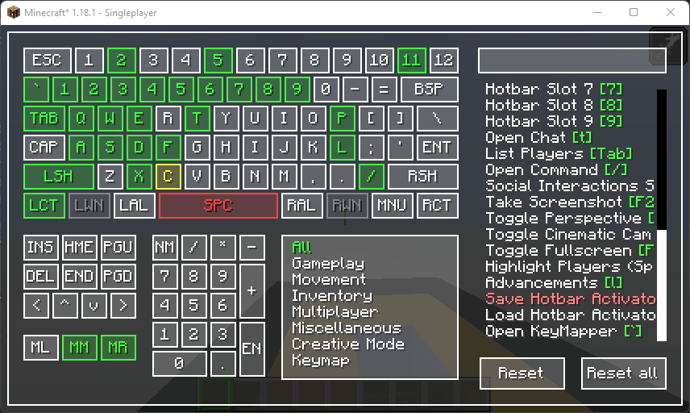
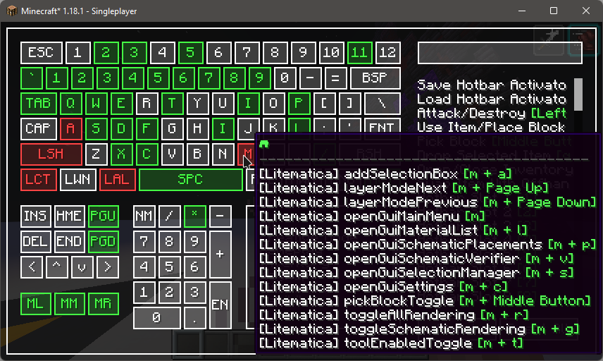

# Keymap
[](https://www.curseforge.com/minecraft/mc-mods/keymap)
[](https://github.com/Einjerjar/keymap)


### New
- Support for overriding the current layout, which should also allows the use of non-standard layouts (colemak, dvorak, etc).
- Added support for `fr_fr` Frances(French) all thanks to @arthurbambou.
- Will post to Curseforge after around 10 more layouts are added, will be posting incremental builds on github [releases](https://github.com/Einjerjar/keymap/releases) for now.

#### Last update
- Different layout for different locales are now a thing! (_but due to how I still need to design the layouts per language, it will still take some time to cover every language)
- I made a tiny tool to help with the keyboard layout creation over [here](https://github.com/einjerjar/keymap-helper) so anyone can help with project.
- If you want to help add a new language or request one, check out `### Layouts` below.
- Check out the supported languages over at `### Layouts` below.

### What

- A visual keymapping mod, specially helpful if you have tons of mods that add keybinds

### Why

- Why not, also, vanilla keybind screen + controlling isn't cutting it, and for some reason, searching with controlling is
  slow on my machine
- ~~Why use a keybind instead of replacing the keybinds screen? idk, I find it easier to use that way, do hit me up if you prefer to have it replace the keybinds screen as a configurable feature~~ (check "How" section)

### How

#### to open the keymapper
- The default keybind is ```" ` "```, aka, the grave accent key, the key below the escape key, or the key along with the tilde `" ~ "`

#### to restore old keybind UI
- If you'd like to have the old Keybinding screen on the options>controls>keybinds menu, then disable `Override Keybind Screen` (access it via ModMenu)

#### to use a custom keyboard layout
- Currently, this is only doable by running the game once to generate the config then modifying the `<minecraft_dir>/config/keymap_keys.json` file, unfortunately this requires you to know the exact keyCodes for your current keyboard layout (_I'm open for help on this one, tho I will still look into it as much as I could_).

### Required Mods

- [Fabric API](https://www.curseforge.com/minecraft/mc-mods/fabric-api)
- [Cloth Config API](https://www.curseforge.com/minecraft/mc-mods/cloth-config)
- [ModMenu](https://www.curseforge.com/minecraft/mc-mods/modmenu) (_to access config_)

### Features

- Visualize all assigned keys
- Visualize keys with multiple assignments
- Filter by searching and/or by category
- You can also filter the keybind with its bound key by using square brackets eg; `[left button]`
- Set keybinds by either pressing a keyboard key or by clicking on the any virtual keys (_except mouse buttons, which can only be set with the virtual keys_)
- Sleek UI (_lol_)
- ~~OCD Triggering misalignment of some panels ( _:D_ )~~ (_removed :<_)
- Completely replaces the default keybinds screen (enabled by default, disable via modmenu config)
- Shows all keybinds bound to a key via tooltip
- Malilib supported along with it's chained hotkeys

---

### Images?

- Status
  - ⬜ `Available`
  - 🟩 `Set`
  - 🟥 `Conflict`
  - 🟨 `Bound to selected item`

  > 
- Malilib
  > 
- Assigned keybinds on hover
  > 
- Filter by category + search
  > 

---

### Latest Changes

#### 0.3.2 beta 2

- text clipping in category as per #6
- fix input widget crashes
- fix input widget delete navigation

#### 0.3.2 beta 1
- Support for custom keyboard layout (_currently a manual process, see ###How_)
- Fixed most malilib related bugs
- Click on virtual key to quickly filter bound keys
- Removed duplicate 'I' key (_finally, lol_)

#### 0.3.0-beta-3
- bugfixes
- checks to prevent malilib related code from leaking when malilib is not available
- text input cursor and basic navigation

#### 0.3.0 beta 2
- Malilib support (_support custom chained keybinds like normal malilib hotkey config, currently keypresses except modifiers are limited to 2 keys_)
- UI rewrite
- New custom widgets from scratch, no more mojank code (_except legacy deprecated code kept for reference, will remove soon_)

---

### Help I can't xx

- **Can't rebind mouse keys?**
  - Currently, rebinding mouse keys requires the user to click on the `ML`, `MM`, and `MR` buttons to assign the `Left button`, `Middle Button`, and `Right Button` respectively.

---

### BUG!

- [Github Issues](https://github.com/Einjerjar/keymap/issues)

---

### Layouts
So the layout per language thingy is now kinda working, I made a tiny tool to help with the keyboard layout creation over [here](https://github.com/einjerjar/keymap-helper) so anyone can help with project.

> `NOTE:` At the moment of writing, if the mod is unable to detect the presence of a layout file for the language, it defaults to `en_us`.

**Current language/locale support**:
- en_us :: English(US)
- de_de :: Deutsch (Deutschland)
- da_dk :: Dansk (Danmark)
- no_no :: Norsk bokmal (Norge)
- fr_fr :: Frances (France) (thanks @arthurbambou, also includes `afnor` and `bepo` variants)

If you want a language added but can't help, send over a language request via Github issues over [here](https://github.com/einjerjar/keymap/issues), with the title `[Layout Request] <Language>`, with an image attachment of the expected keyboard layout, images from Google, or you own keyboard is fine.

If you are able to work with the tool mentioned above, export the file via the export button (making sure that the language code is correct), following this, you can:
- submit a pull request on the keymap repo (_place the yaml file under `/src/main/resources/assets/keymap/layouts`_).

or
- submit an issue [here](https://github.com/einjerjar/keymap/issues), with the title `[Layout Support] <Language>`, with the yaml file from the export attached.

Thanks!

---

### TODO
- [x] Support Malilib hotkeys
- [x] ~~Add conflict counter in the case that a key has more than 2 keys bound to it~~ (_replaced by hover tooltips_)
- [x] Show the actions bound to the key on hover
- [x] Show the key bound to the action on hover
- [x] Show the mod bound to a category on hover ~~(_if that's even possible_)~~ (_currently only works for malilib mods, will look into support for other mods soon_)
- [x] Support overriding the default keybind screen
- [ ] Support different keyboard layouts (_working but still needs work_)
- [ ] Differentiate conflicting keybinds from keybinds with malilib chains for easier navigation
- [x] Clicking on virtual key wil filter the keybind list

---

### Support

<a href='https://ko-fi.com/X8X831J1L' target='_blank'></a>

---
