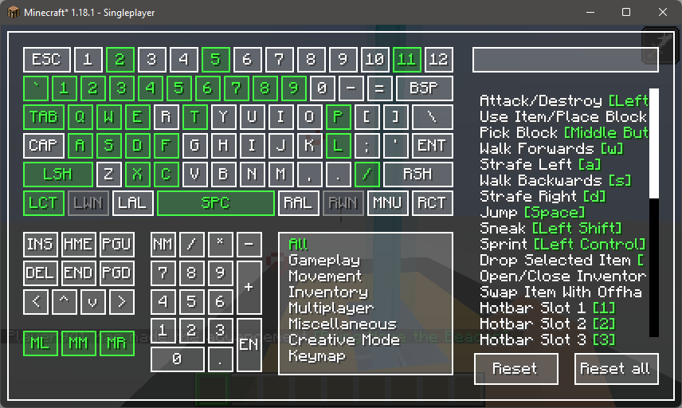

# Keymap

### What

A visual keymapping mod, specially helpful if you have tons of mods that add keybinds

### Why

Why not, also, vanilla keybind screen + controlling isn't cutting it, and for some reason, searching with controlling is
slow on my machine

### Features

- Visualize all assigned keys
- Visualize keys with multiple assignments
- Filter by searching and/or by category
- You can also filter the keybind with its bound key by using square brackets eg; `[left button]`
- Set keybinds by either pressing a keyboard key or by clicking on the any virtual keys (_except mouse buttons, which can only be set with the virtual keys_)
- Sleek UI (_lol_)
- OCD Triggering misalignment of some panels ( _:D_ )

### Images?

- Base look
  
- Filter by category + search
  
- Status
  - ⬜ `Available`
  - 🟩 `Set`
  - 🟥 `Conflict`
  - 🟨 `Bound to selected item`
  

### Help I can't xx

- **Can't rebind mouse keys?**
  - Currently, rebinding mouse key requires the user to click on the `ML`, `MM`, and `MR` buttons to assign the `Left button`, `Middle Button`, and `Right Button` respectively.

### BUG!

- [Github Issues](https://github.com/Einjerjar/keymap/issues)

### Todo
- [ ] Support Malilib hotkeys
- [ ] Add conflict counter in the case that a key has more than 2 keys bound to it
- [ ] Show the actions bound to the key on hover
- [ ] Show the key bound to the action on hover
- [ ] Show the mod bound to a category on hover (_if that's even possible_)

### Support

