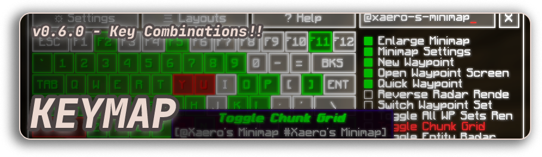
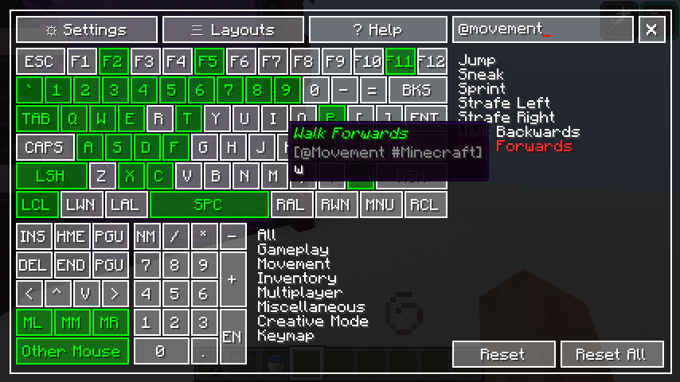
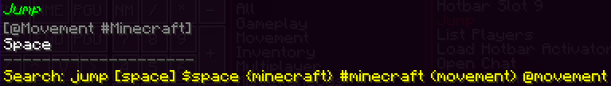

Keymap Rewrite
===

Visual key remapping mod for Minecraft

TOC
===

* [Overview](#overview)
    * [Important Stuff](#important-stuff)
    * [Colors](#colors)
    * [Queries](#queries)
    * [Screenshots](#screenshots)
    * [Support](#support)

Overview
===

Important stuff
---

- Press the `Grave Accent` / `Backtick` ``( ` )``, or the key under the Escape key to show the mapper while playing
- `CTRL+F` : focus search box
- Register all other mouse keys using the `Other Mouse` button by clicking directly on it
- You can use `CTRL`, `SHIFT` and `ALT` as keybind modifiers
- The modifier system does not block the default use of the modifier keys, that is to say;
    - Pressing `CTRL+Q` while walking, will make you sprint
    - Pressing `SHIFT+W` will make you crouch ,but will not make you walk
- You can still assign modifier keys by themselves normally
- You cannot bind multiple keymaps to a single combination

Colors
---

|              Color | Legend            |
|-------------------:|-------------------|
|            `white` | Not Assigned      |
|            `green` | Assigned          |
|           `yellow` | Selected          |
|              `red` | Conflict          |
| `small yellow box` | Modifier assigned |

Queries
---

|          Format | Effect           |
|----------------:|------------------|
| `(sample text)` | Category         |
|  `@sample_text` | Category (slug)  |
| `{sample text}` | Mod name         |
|  `#sample_text` | Mod name (slug)  |
| `{sample text}` | Bound key        |
|  `$sample_text` | Bound key (slug) |

Screenshots
---

Todo
---

- Widgets
    - Button
    - Toggle
    - Input

Support
---

